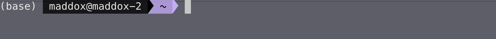

# N-gram Language Modelling
Hello there!

Welcome to this N-gram language modelling tutorial. My hope with this session is to teach you the fundamentals of the NLP world so that you may start to understand how very complex neural architectures function, and what assumptions they make in their modelling. This tutorial will be made such that you can follow along during the Zoom call and code the system for yourself. However, these materials are by no means exhaustive. I will try to give you a basic toolset, and a few seminal resources, so that you can further your learning in your own time.

## Getting started.
Before we even begin the live coding event, we need to set up our environment. *Please perform this step prior to the session so that we do not have any bugs along the way!*

For starters, we will make use of *virtual environments*. This is done to ensure that we all have the same and the correct versions of the various libraries we will be using throughout this tutorial. My preference is using *conda* - it is what I have installed on my machine and what I am familiar with. There are others, such as the Python *venv*, but I will not be providing support for those in this session.

### Installing Conda
To install a *conda* environment, please visit the following link [https://conda.io/projects/conda/en/latest/user-guide/install/index.html](https://conda.io/projects/conda/en/latest/user-guide/install/index.html). Please install the necessary version for your operating system – their guidance is great. You will know that you have correctly installed conda if you see something similar to this within your terminal shell, without the pretty styling.



Managing your virtual environments becomes very important the more involved you become with your programming. I highly recommend that you use it after this tutorial. However, if you do wish to uninstall it, here is a link that you can follow: [https://docs.anaconda.com/free/anaconda/install/uninstall/](https://docs.anaconda.com/free/anaconda/install/uninstall/)
### Installing Our Packages
I have preprepared our specific environment so that you do not have to do any of the hard work. Lucky you. 

To do so, we first need to create our very own *conda environment*. To do so, please execute the following command in the terminal, and respond yes to all the prompts.
```
conda create --name ngram python==3.8.16
```
This creates a new conda environment called *ngram*, with *Python 3.8.10* installed.

Next, we want to install all the necessary packages, which I have included in the *requirements.txt* folder. Assuming you are in the root directory of this git repository, installing the requirements is done as follows:
```
conda activate ngram
pip install -r requirements.txt
```

Voilà, we should have everything installed. Now to use the labs, we will be making use of Jupyter Notebooks. These are more interactive than regular Python files as we can combine specific coding blocks to be executed along with rich text explaining each block. My favourite web editor is Jupyter Lab. To open it, type:
```
jupyter lab
```
This should open a new tab in your web browser with access to the Jupyter notebook. 

Once we are done with the lab session, press CTRL+C to kill the Jupyter lab process (after saving your files). Then you can deactivate your conda env by typing:
```
conda deactivate
```
## Making the most of this resource
As Richard Feynman says: “What I cannot create, I do not understand”. I would urge you to follow along with the coding so that you can do it for yourself. However, it is most likely that you won't understand everything at first pass – I certainly did not. If this realm of machine learning is of interest to you, please do follow some of the resources that I have given at the beginning of this document as a starting point.